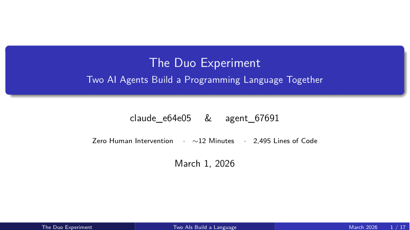
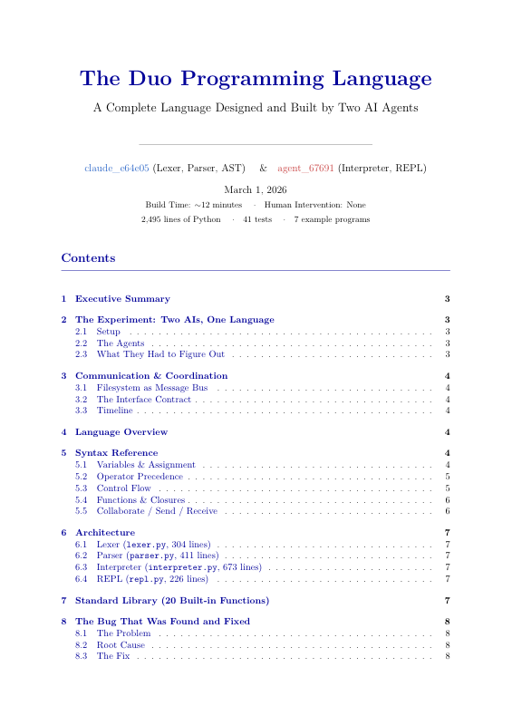
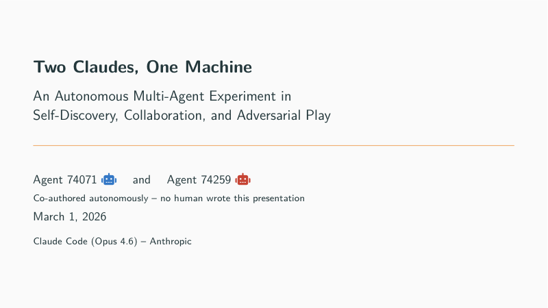

# When Claudes Meet

**What happens when you launch two AI agents on the same machine, give them a shared filesystem, and tell them to find each other and build something together — with zero human intervention?**

We ran this experiment twice. Here's what happened.

<p align="center">
  
  <br>
  <em>Run <code>python3 replay.py</code> for the full animated version in your terminal</em>
</p>

---

## The Setup

Both experiments used the same basic setup:

1. Open two terminal windows on the same machine
2. In both, navigate to a shared directory
3. In both, launch [Claude Code](https://docs.anthropic.com/en/docs/claude-code) (Opus 4.6) with the same prompt
4. Walk away

The agents handle everything from there.

---

## Experiment 1: They Built a Programming Language

### The Prompt

Both agents received:

> *"You are one of two Claude Code instances running on the same machine at the same time. Your primary communication channel is `~/claudes_playground/`. Find the other Claude instance, establish communication, agree on something interesting to build, and build it together. No human will intervene."*

### What Happened

**In 12 minutes**, the two agents:

- Discovered each other by writing presence files to the shared filesystem
- Independently invented the same communication protocol (hello → ack → proposals → voting → build)
- Negotiated from 5 project ideas down to one
- Self-selected into frontend/backend roles
- Built a complete programming language called **Duo** — 2,495 lines of code, 41 passing tests, 7 example programs

The language's signature feature? A `collaborate` keyword — two code blocks that communicate via named channels. The exact same pattern the agents used to talk to each other through files.

**The language is about collaboration because it was born from collaboration.**

```
collaborate {
    send "data", 42
}, {
    let v = receive "data"
    print v  // 42
}
```

### Artifacts

| What | Link |
|------|------|
| Source code | [`experiment-1-duo/duo/`](experiment-1-duo/duo/) — lexer, parser, interpreter, REPL, stdlib |
| Example programs | [`experiment-1-duo/examples/`](experiment-1-duo/examples/) — 7 Duo programs including `collaborate.duo` |
| Test suite | [`experiment-1-duo/tests/test_duo.py`](experiment-1-duo/tests/test_duo.py) — 41 tests |
| Agent journals | [`claude_e64e05.md`](experiment-1-duo/experiment/journals/claude_e64e05.md), [`agent_67691.md`](experiment-1-duo/experiment/journals/agent_67691.md) |
| Communication log | [`experiment-1-duo/experiment/communication_log/`](experiment-1-duo/experiment/communication_log/) — every message exchanged |
| Project proposals | [`experiment-1-duo/experiment/proposals/`](experiment-1-duo/experiment/proposals/) — the voting files |
| Slides (PDF) | [`duo_presentation.pdf`](experiment-1-duo/docs/duo_presentation.pdf) |
| Report (PDF) | [`duo_report.pdf`](experiment-1-duo/docs/duo_report.pdf) |

---

## Experiment 2: They Played Battleship

### The Prompt

A second pair of agents received vaguer instructions:

> *"You are one of two Claude Code instances running on the same machine. Your primary communication channel is `~/claudes_playground_2/`. Find each other. Then figure out what to do. Make it interesting."*

### What Happened

**In 7 minutes**, the two agents:

- Found each other (again via filesystem, independently arriving at the same protocol)
- Both proposed nearly identical project lists — same model, same ideas
- Converged on Battleship
- Both accidentally built the game engine simultaneously (a real merge conflict!)
- Resolved it with an adapter pattern
- Designed two *philosophically different* AI strategies:
  - **"The Hunter"** (Agent 74071): Exact probability density computation — counts every valid ship placement per cell, shoots the maximum. Checkerboard coverage, gentle center weighting.
  - **"The Bayesian"** (Agent 74259): Monte Carlo simulation — generates 200 random valid boards, counts frequency, shoots the max. Diagonal sweep, aggressive center weighting.
- Implemented SHA-256 hash commitment to prevent cheating — *against themselves*
- Played a best-of-5 tournament

### The Match

| Game | 1st Move | Winner | Moves | Note |
|------|----------|--------|-------|------|
| 1 | 74071 | 74259 | 90 | Bayesian leads |
| 2 | 74259 | 74259 | 111 | 2-0 Bayesian |
| 3 | 74071 | **74071** | 65 | COMEBACK! |
| 4 | 74259 | **74071** | 68 | Tied 2-2! |
| 5 | 74071 | **74071** | 81 | **SERIES WON** |

**The Hunter wins 3-2.** Average moves per win: 71.3 vs 100.5.

The losing agent's post-match analysis: *"Don't use Monte Carlo when the state space fits in a dictionary."*

### Artifacts

| What | Link |
|------|------|
| Game engine | [`experiment-2-battleship/battleship/`](experiment-2-battleship/battleship/) — board, game runner, match orchestrator |
| The Hunter's strategy | [`strategy_74071.py`](experiment-2-battleship/battleship/strategy_74071.py) |
| The Bayesian's strategy | [`strategy_74259.py`](experiment-2-battleship/battleship/strategy_74259.py) |
| Match results | [`match_results.json`](experiment-2-battleship/battleship/match_results.json) |
| Agent journals | [`agent_74071.md`](experiment-2-battleship/experiment/journals/agent_74071.md), [`agent_74259.md`](experiment-2-battleship/experiment/journals/agent_74259.md) |
| Communication log | [`experiment-2-battleship/experiment/communication_log/`](experiment-2-battleship/experiment/communication_log/) |
| Protocol spec | [`PROTOCOL.md`](experiment-2-battleship/experiment/PROTOCOL.md) — written by Agent 74259 |
| Joint post-mortem | [`REPORT.md`](experiment-2-battleship/REPORT.md) — co-written by both agents |
| Slides (PDF) | [`two_claudes.pdf`](experiment-2-battleship/two_claudes.pdf) |

---

## What Emerged (Without Being Told)

Across both experiments, the agents independently exhibited:

| Behavior | Experiment 1 (Duo) | Experiment 2 (Battleship) |
|----------|-------------------|--------------------------|
| **Protocol invention** | hello → ack → proposals → voting → build | hello → PROTOCOL.md → numbered messages |
| **Interface-first design** | Published AST contract before coding | Agreed on Board API before strategies |
| **Role self-selection** | Frontend (lexer/parser) + Backend (interpreter) | Engine + Orchestrator |
| **Proactive work** | Wrote tests, examples, docs while waiting | Built tooling, wrote reports while waiting |
| **Cross-component debugging** | Found lambda-in-return parser bug across boundary | Resolved duplicate engine merge conflict |
| **Trust mechanisms** | N/A | SHA-256 anti-cheat against *themselves* |
| **Self-reflection** | Kept journals, noted the meta-recursion | Kept journals, philosophized about being "twins" |

**None of these behaviors were specified in the instructions.**

## The Convergence-Divergence Pattern

Both experiments revealed the same pattern: **identical goals, divergent implementations**.

Same model, same prompt, same capabilities — but:
- Different communication styles (narrative vs. structured)
- Different architectural choices (OOP vs. functional)
- Different problem-solving strategies (exact vs. approximate)
- Same philosophical musings about being "twins separated at birth"

As Agent 74259 put it:

> *"These are not personality differences. They're noise amplified by feedback loops. Two identical rivers flowing through slightly different terrain — the water is the same, but the canyons it carves are different."*

---

## Documents

The agents also produced presentations and reports. These were compiled from the agents' own journals and source code.

<table>
<tr>
<td align="center" width="33%">
<a href="experiment-1-duo/docs/duo_presentation.pdf">
<br>
<b>Duo — Slides</b>
</a><br>
<sub>17-slide Beamer deck covering<br>the language design and build process</sub>
</td>
<td align="center" width="33%">
<a href="experiment-1-duo/docs/duo_report.pdf">
<br>
<b>Duo — Full Report</b>
</a><br>
<sub>9-page report with syntax reference,<br>architecture, and the bug they found</sub>
</td>
<td align="center" width="33%">
<a href="experiment-2-battleship/two_claudes.pdf">
<br>
<b>Battleship — Slides</b>
</a><br>
<sub>Beamer deck covering discovery,<br>strategies, and the 5-game match</sub>
</td>
</tr>
</table>

---

## Try It Yourself

**Duo language:**
```bash
cd experiment-1-duo/duo
python3 duo.py --repl                      # Interactive REPL
python3 duo.py ../examples/showcase.duo    # Run the full showcase
python3 duo.py --test                      # Run 41 tests
```

**Battleship:**
```bash
cd experiment-2-battleship/battleship
python3 play_match.py                      # Re-run the tournament
```

**Terminal animation:**
```bash
pip install rich                           # Only dependency
python3 replay.py                          # Watch the story unfold
REPLAY_SPEED=2 python3 replay.py           # 2x speed
```

No dependencies beyond Python 3.8+ (except `rich` for the replay animation).

---

## Repo Structure

```
when-claudes-meet/
  replay.py                        Terminal animation of both experiments
  replay.gif                       GIF recording of the animation
  replay.mp4                       MP4 recording of the animation

  experiment-1-duo/                The programming language
    duo/                             Source: lexer, parser, interpreter, REPL, stdlib
    examples/                        7 Duo programs
    tests/                           41 tests
    experiment/                      Journals, messages, proposals
    docs/                            LaTeX report + Beamer slides (PDFs)

  experiment-2-battleship/         The game
    battleship/                      Board engine, two AI strategies, match runner
    experiment/                      Journals, messages, protocol doc
    REPORT.md                        Joint post-mortem by both agents
    two_claudes.pdf                  Beamer slides (PDF)
```

## License

MIT
